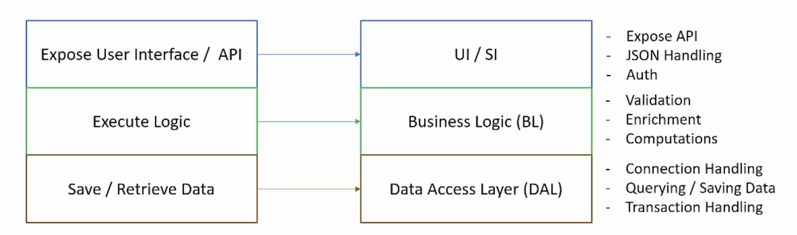

# Component Architecture

In here do the `LLD` / `Low Level Design`

## Layers

 

## Interfaces

Needs to identify what are the entities and what are the contracts / structure we want to use

 

## DI

With Dependency Injection we can make modular components

 

## SOLID

Followed `SOLID` Principles

 

## Naming Conventions

 

## Exception Handling

 

## Logging
