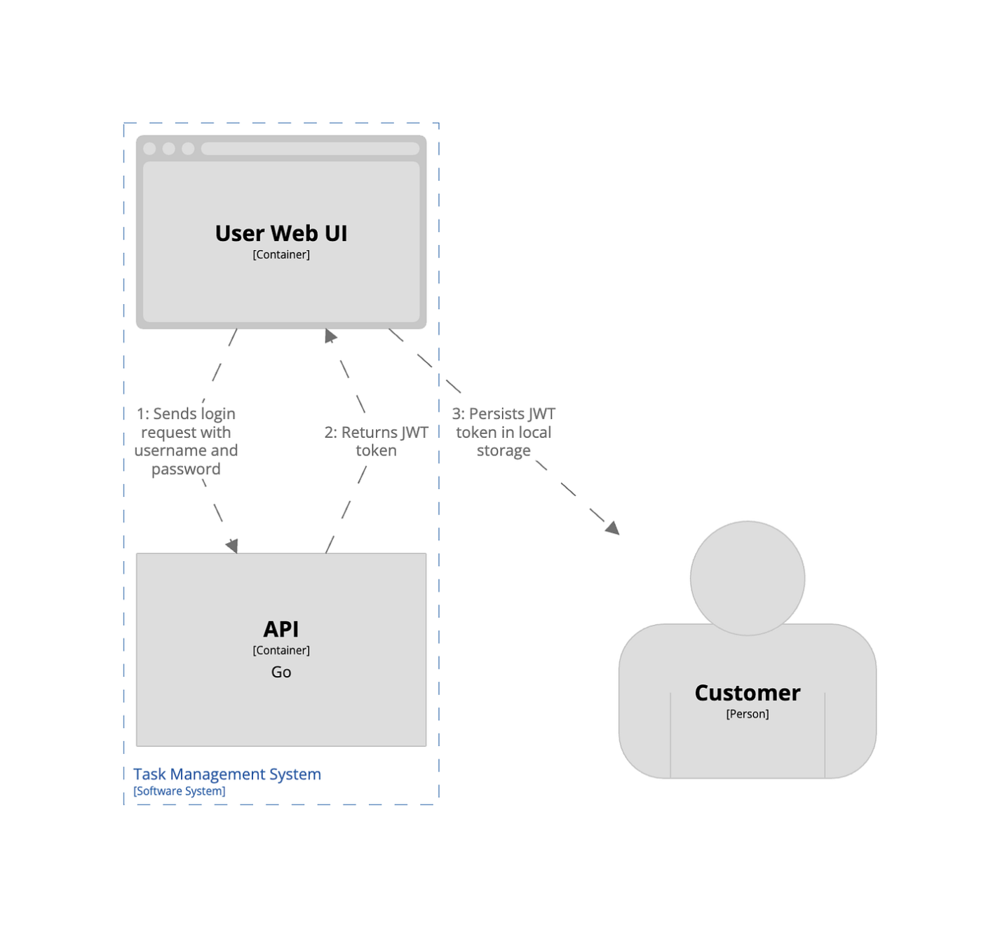

# Code



Here we show classes.

The deepest level of zoom is the code diagram. Although this diagram exists, it is often not used as the code paints a very similar picture. However, in highly regulated environments and complex legacy projects this level can help to paint a better picture of inner intricacies of the software.

In that case, the Code Diagram focuses primarily on the internal structure that components usually contain, classes, or objects. Not every situation demands this amount of detail, and such diagrams are frequently created automatically by tools, such as Integrated Development Environments (IDEs). Since C4 doesn't define the notations at this level, other modeling notations, such as UML, can be used to represent code structure.

<br/>

`Purpose`: The implementation level details will be depicted, such as class structures.

`Audience`: All the developers that need to see code-level details.

`Important Details`: Often this level can be generated automatically with tools, hence it might not be necessary to create these diagrams manually.

<br/>

```pwd
TaskController

↓

TaskService

↓

TaskRepository

↓

JpaRepository
```

or

```pwd
User.java

Role.java

Permission.java

AuthController.java

JwtProvider.java

UserRepository.java
```

---


