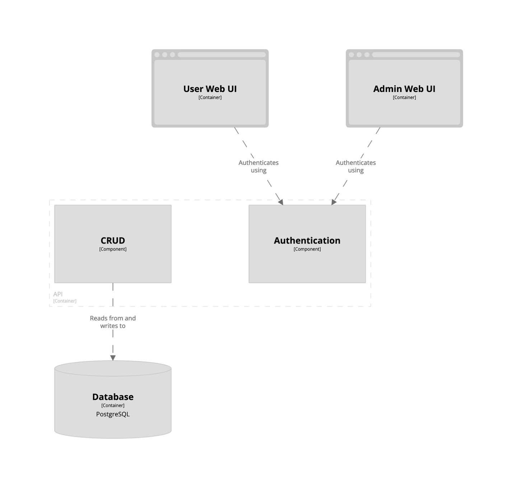

# Component

The next level of zoom is components. `Suppose we zoom into the Spring Boot Backend`. This shows the major structural building blocks of your application, and is often a conceptual view of the application. The term component is loose here. It could represent a controller or a service containing business logic.

This diagram focuses on the internal structure of the API container within the Task Management Software System. It reveals that the API container houses crucial functionalities like CRUD operations (Create, Read, Update, Delete) for data manipulation and user authentication mechanisms. The CRUD components is the one that talks to the database.

 

`Purpose`: Breaking down each container to show how internal components work together.

`Audience`: Technical teams for closer views of the inner details.

`Important Details`: The level of detail is higher here; hence, it is best used for teams that are directly working on the software.
