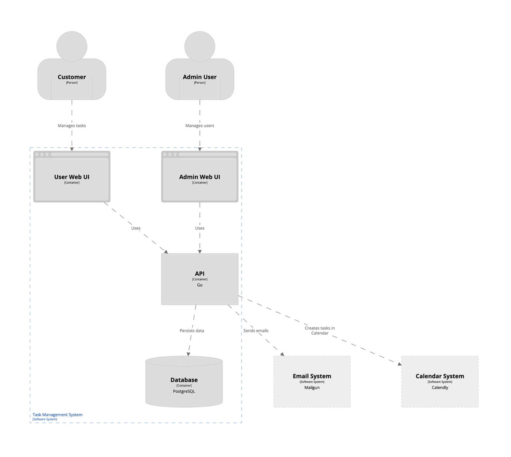

# Container



`Container` means an application or data store that can be deployed independently.

<br/>

`Purpose`: Understand the building blocks of your system.

`Audience`: More technical stakeholders who require further details than what the Context Diagram can give them.

`Important Details`: More often than not, in this layer, one could introduce more technical information, like the programming languages being used and the types of databases. Where the Context Diagram usually tries to convey the whole, big picture, the Container Diagram goes into the internal structure of the system.

<br/>

Examples:
    - React App
    - Angular App
    - Spring Boot API
    - Node API
    - PostgreSQL
    - Redis
    - RabbitMQ
Each is a container.

<br/>

```pwd
                 User
                   |
                   v

        +---------------------+
        | React Frontend      |
        +----------+----------+
                   |
         HTTPS REST API
                   |
                   v
        +----------------------+
        | Spring Boot Backend  |
        +----------+-----------+
                   |
      +------------+-------------+
      |                          |
      v                          v

+-------------+          +----------------+
| PostgreSQL  |          | Redis          |
+-------------+          +----------------+

                   |
                   v

           Email Service
```
