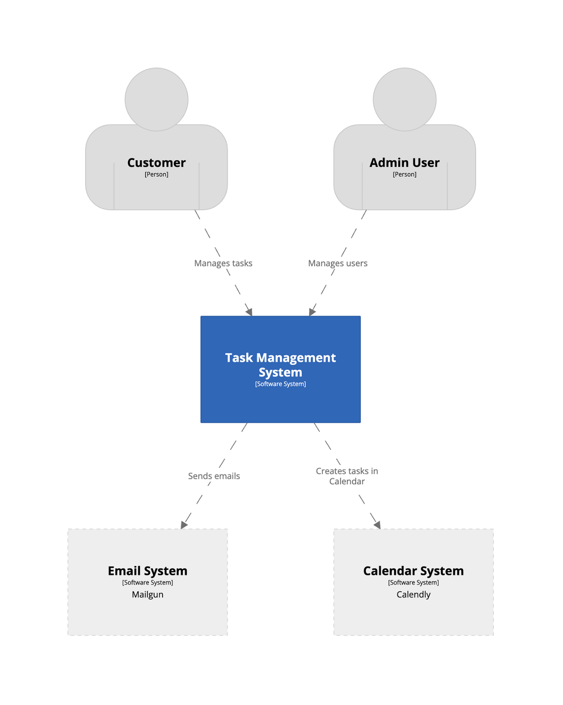

# Context



This level is the most zoomed out. It's a bird’s eye view of the system in the greater context of the world. The diagram concentrates on actors and systems.

Imagine you're explaining your application to your CEO. Only relationships. No Code. No Technologies.

`Purpose`: High-level understanding of how the system interacts with the outside world.

`Audience`: Both technical and nontechnical stakeholders.

`Important Details`: Would a non-technical person get it instantly from this diagram? If not try to further simplify it.

<br/>

Questions answered:
    - What system is this?
    - Who uses it?
    - Which external systems interact with it?

<br/>

Only:
    - Users
    - Your System
    - External Systems

<br/>

This diagram is useful for:
    - managers
    - clients
    - architects
    - product owners

<br/>

```pwd
Task Management System

Purpose:
Allows teams to manage tasks.

Users:
- Employee
- Manager
- Administrator

External Systems:
- Google Login
- Email Provider
- Slack
- Stripe
```