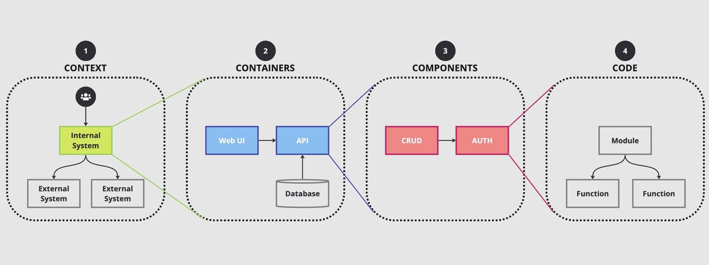
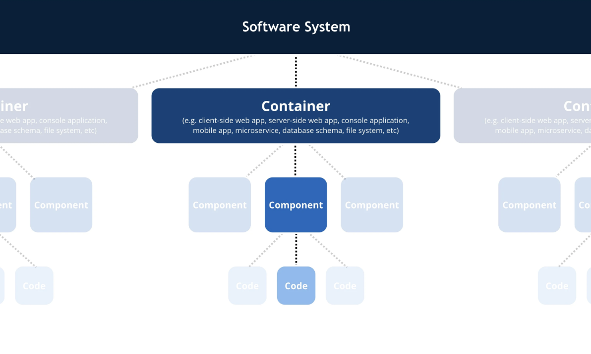

# C4 Model




The `C4 Model` is one of the most practical software architecture modeling techniques.

It was created by `Simon Brown` because traditional UML diagrams became too complicated and inconsistent.

<br/>

The idea behind C4 is very simple:

```pwd
Different people need different levels of detail.
```

<br/>

Just like Google Maps.
    - World View → Country
    - Country → City
    - City → Streets
    - Street → Buildings

<br/>

This has 4 levels of Zoom

```pwd
+------------------------+
| Level 1 Context        |
+------------------------+

        ↓

+------------------------+
| Level 2 Containers     |
+------------------------+

        ↓

+------------------------+
| Level 3 Components     |
+------------------------+

        ↓

+------------------------+
| Level 4 Code           |
+------------------------+
```

<br/>

You're looking at implementation before understanding the system.

C4 fixes this.

It starts from the outside and gradually zooms in.

<br/>

## Components of C4 Model

- [Context](./context.md)
- [Containers](./containers.md)
- [Component](./component.md)
- [Code](./code.md)

<br/>

## Each Level Comparison

| Level             | Focus                                    | Audience                                                | Typical Elements                                       |
| ----------------- | ---------------------------------------- | ------------------------------------------------------- | ------------------------------------------------------ |
| 1. System Context | How the system fits into the world       | Business stakeholders, product owners, new team members | Users, your system, external systems                   |
| 2. Containers     | Major deployable/runtime building blocks | Architects, developers, DevOps                          | Web apps, APIs, databases, message brokers, caches     |
| 3. Components     | Internal structure of a single container | Developers                                              | Controllers, services, repositories, modules, adapters |
| 4. Code           | Implementation details                   | Developers                                              | Classes, interfaces, methods, relationships            |

<br/>

## Common Mistakes

- Thinking "container" means Docker. In C4, a container is a deployable application or data store, regardless of whether it runs in Docker.

- Putting classes into Level 2. Class-level detail belongs at Level 4.

- Skipping Level 1. Many teams jump straight into APIs and databases without first defining the system boundary and external interactions.

- Trying to show every class on one diagram. Each diagram should communicate one level of abstraction clearly.

- Including every framework and library. Technology choices (e.g., Spring Boot, React, Kafka) are relevant only where they help explain the architecture at that level.

<br/>

## How to Practice

With Technologies and your goal of becoming a software architect, an excellent exercise is to take one of your own projects produce all four C4 diagrams in order:

- `System Context`: Define users and external systems (e.g., OpenAI API, email provider).

- `Container`: Show the React frontend, Spring Boot backend, PostgreSQL, Redis, and any AI or messaging services.

- `Component`: Zoom into the Spring Boot backend and model modules like Authentication, Chat, Document Processing, and Conversation Management.

- `Code`: For one module (such as Authentication), draw the main classes and their relationships.

Creating these four diagrams for a real application is one of the fastest ways to internalize the C4 Model and think like an architect rather than just an implementer.

<br/>

## Examples

[View and Study Example](./example.md)
[View Github Repo](https://github.com/plutov/c4-diagram-example)
[View Diagrams](https://c4model.com/diagrams)
