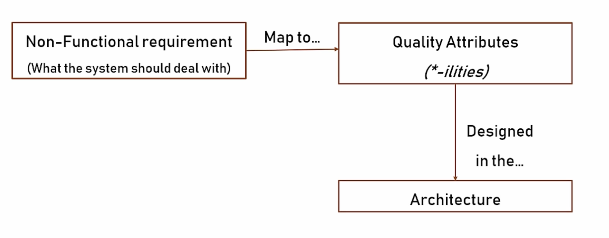

# *-ilites

`These are some of the technical capabilities that should be use in order to full fill the non-functional requirements`

Software `ilities` are critical non-functional quality attributes that dictate how a system behaves, performs, and evolves, rather than what specific features it offers

 

## Attributes

They are essential for software architecture and are broadly grouped into `Operational`, `Structural`, and `Cross-Cutting` categories

**Operational Attributes (Runtime Behavior)**
These directly impact how the software performs, scales, and stays online for users in production

**Structural Attributes (Development & Maintenance)**
These affect the codebase, how easy the software is to update, and how developers interact with it

**Cross-Cutting Attributes (System Qualities)**
These impact both developers and end-users across multiple dimensions of the application

 

| Attribute | Description |
| :--- | :--- |
| **Reliability** | The probability that the software will perform its required functions under stated conditions for a defined period without failure. |
| **Availability** | The degree to which a system is accessible, operational, and usable when required by the user, usually measured in uptime percentages. |
| **Scalability** | The ability of the system to handle growing amounts of work or expanding user bases gracefully by adding computational resources. |
| **Efficiency** | The ratio between the level of performance of the software and the amount of computational resources (memory, CPU, network) it consumes. |
| **Maintainability** | The ease with which software can be modified, repaired, or updated to correct faults, improve performance, or adapt to changes. |
| **Extensibility** | The system's architectural design that allows for the addition of new capabilities or functionalities with minimal impact to existing code. |
| **Testability** | The ease with which software components can be tested to verify that they meet requirements and perform as expected before deployment. |
| **Portability** | The ability of the software to run in different environments or on different platforms with minimal or no modifications. |
| **Usability** | The extent to which the software interface is intuitive, easy to learn, and efficient for the target user to operate. |
| **Security** | The system's ability to protect data and programs against unauthorized access, malicious attacks, or accidental data destruction. |
| **Interoperability** | The capability of the software to communicate, exchange data, and use information seamlessly with other external systems. |
