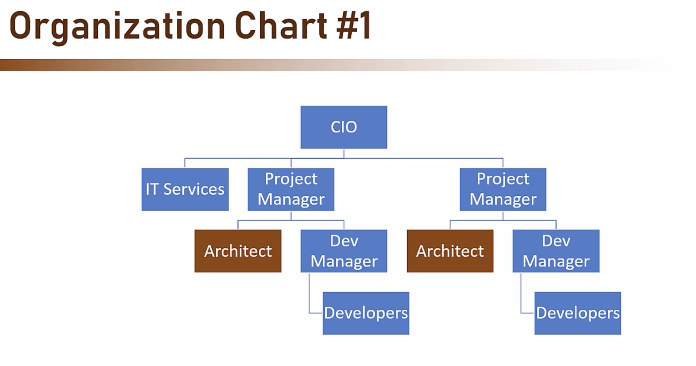
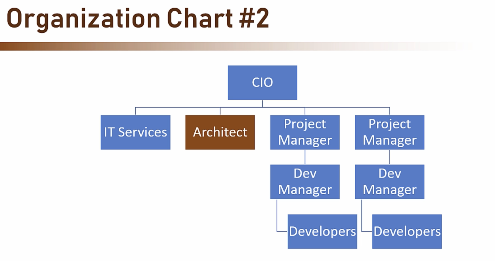
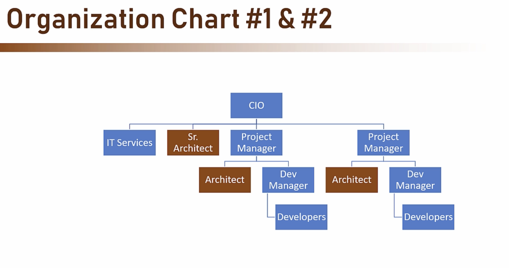
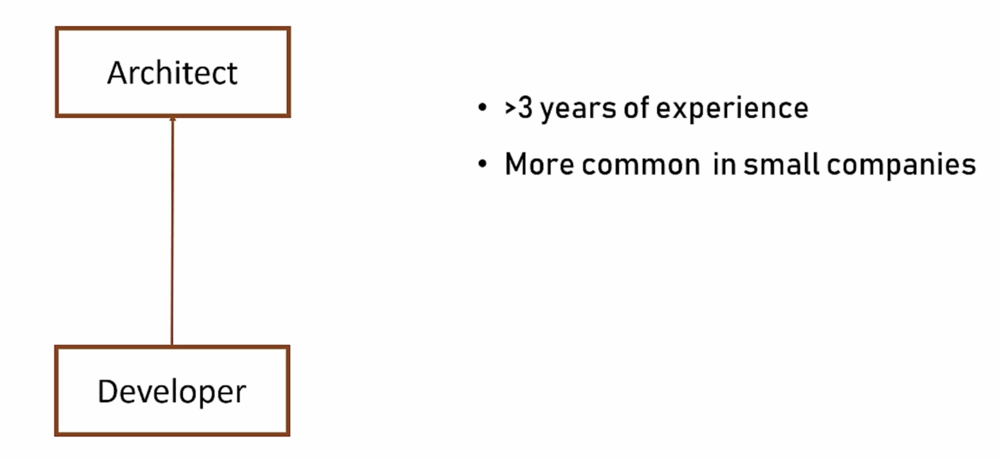
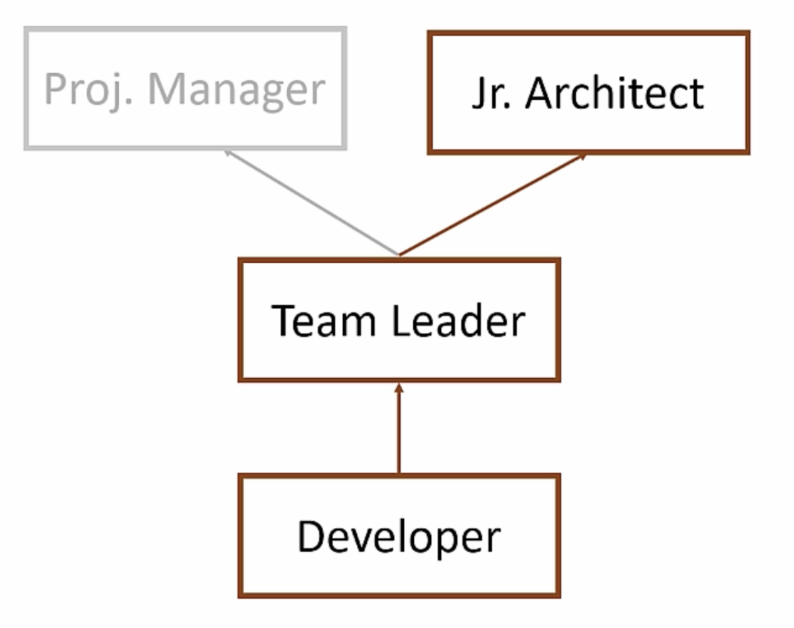
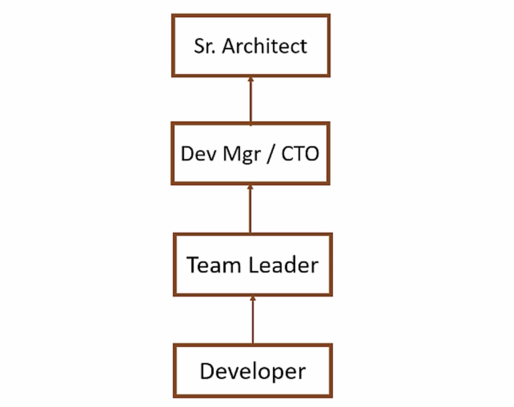
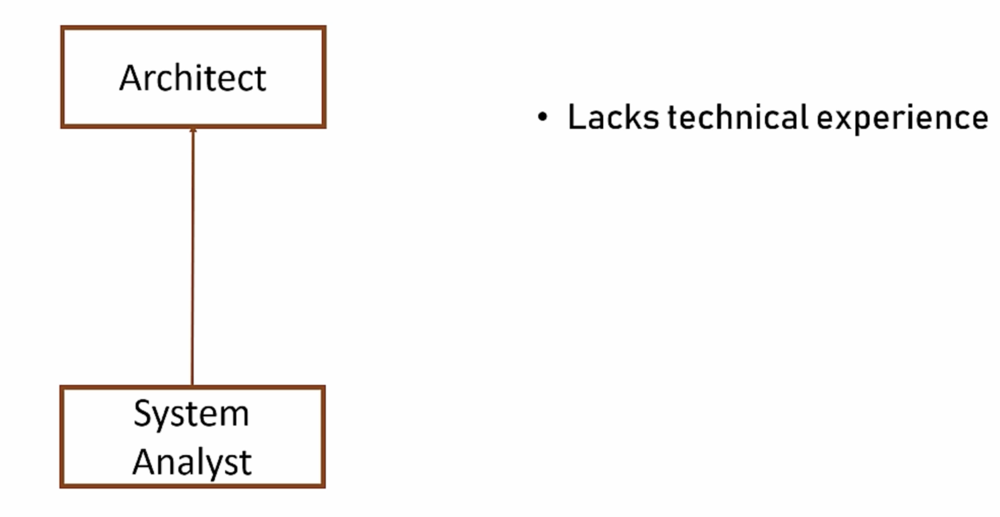

# What is Software Architech

A `software architect` is a senior IT professional who makes high-level design choices and dictates the technical standards, coding frameworks, and overall structure of a software system

They bridge the gap between business needs and technology by translating client requirements into actionable development blueprints

<br />

## Core Responsibilities

- `System Design`: Creating the fundamental structure of an application, defining its components, and outlining how they interact with one another

- `Technology Selection`: Choosing the appropriate programming languages, databases, frameworks, and cloud platforms required for the project

- `Addressing Non-Functional Requirements`: Ensuring the system meets essential operational standards like scalability, security, performance, fault tolerance, and maintainability

- `Technical Leadership`: Setting coding standards, conducting code reviews, mentoring developers, and guiding the team through technical hurdles

<br/>

## Architect Specializations

[READ MORE ABOUT ROLES](../types/index.md)

<br/>

## Responsibilities

```bash
Developer knows what can be done
    Archietct knows what should be done
```

<br/>

## Baseline Requirements

- Fast
- Secure
- Reliable
- Easy to Maintain

<br/>

## Organizational Level

Junior Architects


Senior / Chief Architects


Combination


<br/>

## Why should they code

- Architecture's Trustworthiness
- To support for developers
- To gain respect

<br/>

## Academics and Qualifications

- Bsc
- Msc
- Phd
- Other Certifications

```bash
Actually no qualifications but should be experience not only formal cert or qualifications
```

<br/>

## Career Path





