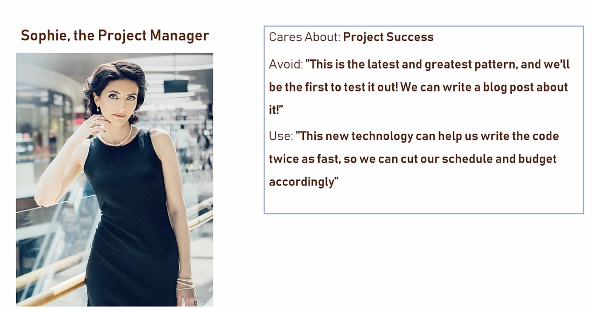
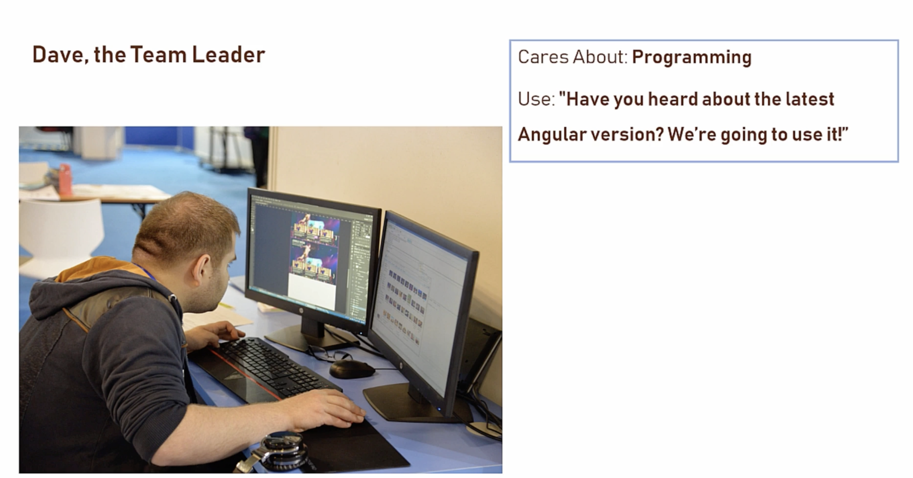
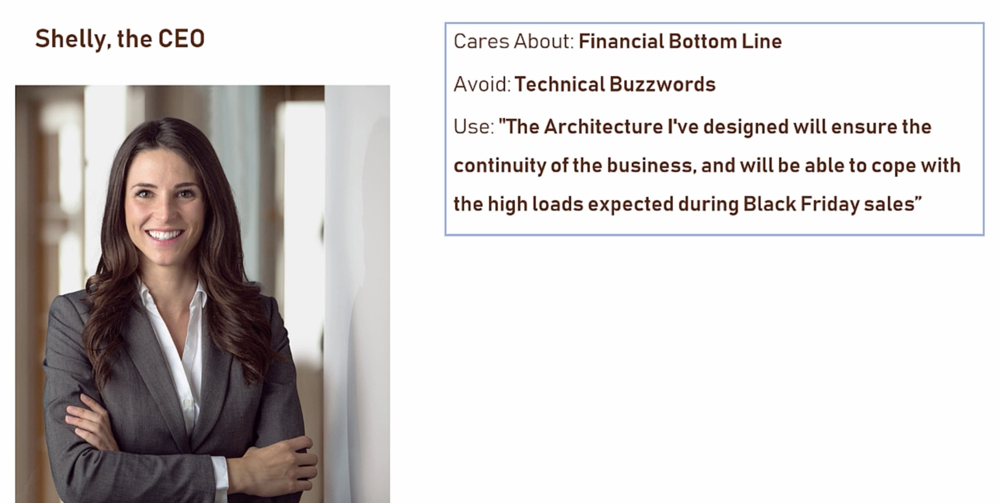

# Architecture Mindset

- Understand the Business / Client / Employer
- Work for the clients / client's client
- Familier with weaknesses and strengths / competition / growth stratergies
- Looking system goals / requirements

- Watch your language

```bash
Always remember, What is the thing that really matters, to the person you are talking to
```





So,
```bash
As an architect, what knowledge you should have BEFORE beginning work for a new company is, How is this company doing the business wise 
```
